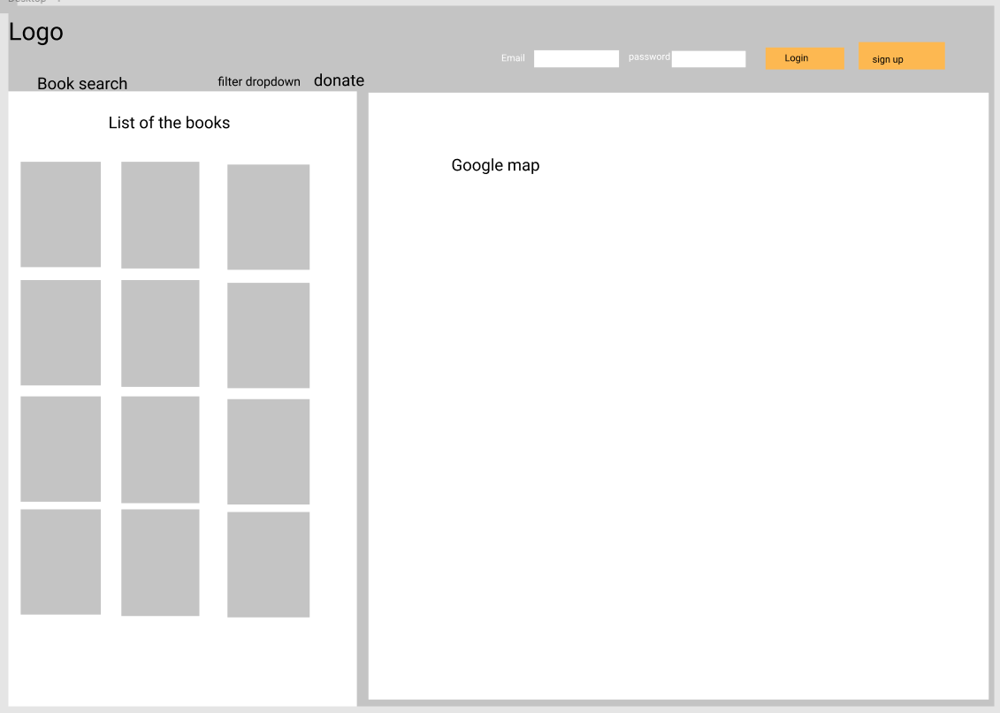
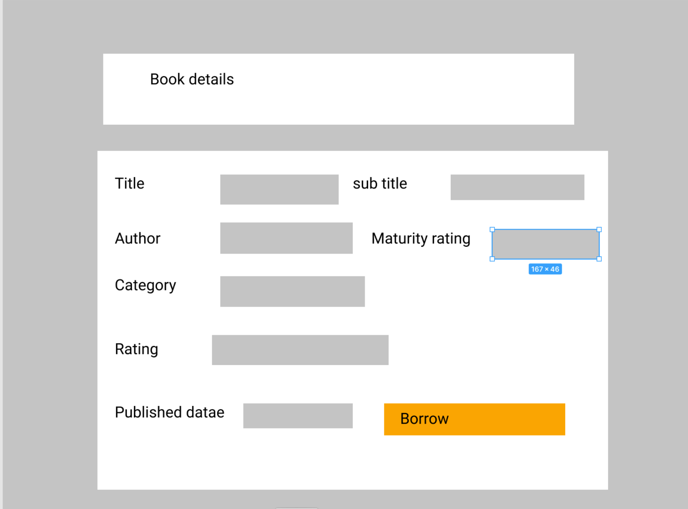
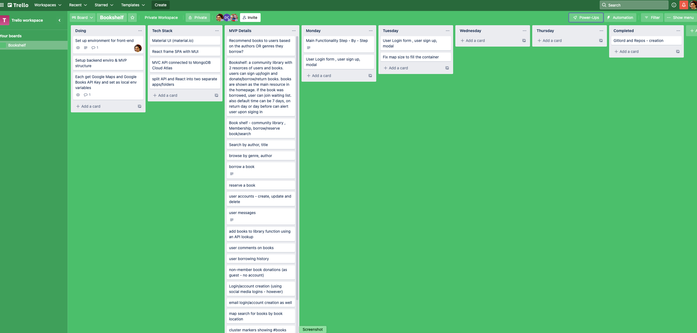
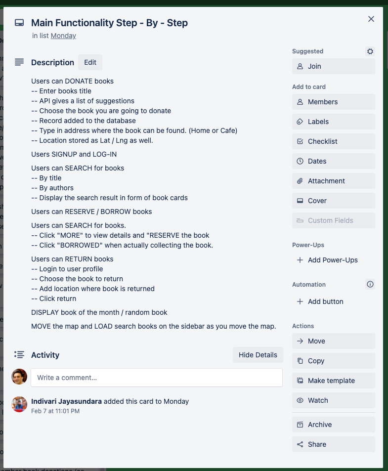
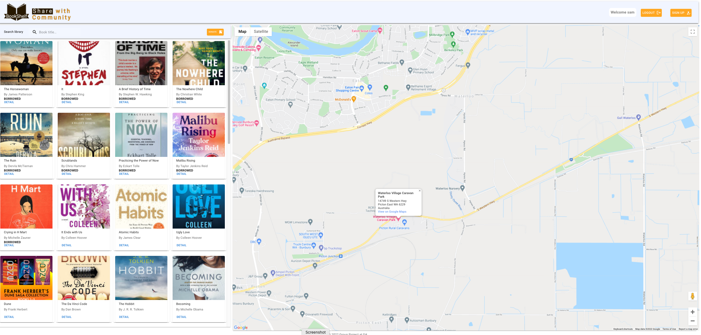

# BookShelf APP - a community library 
## Fullstack, RESTful App Built by : MERN stack - ReactJS, Node.JS, Express, MongoDB, and Material UI (MUI)
#### Google Maps API, GOOGLE PLACES API, and GOOGLE BOOKS API.
#### A group project, contributors can be found in this Git's right panel
#### Main features: 

- Users signup/login/log out
- Users can lookup books in Google Books api and then Donate to our library.
- Users can search in the local library, filtring the books shown in the sidebar.
- Clicking on each book card (detail) will open a new modal with books details with the options of Borrow or Return depending on books availability.
- Google Maps show the location of street libraries, and book locations where users can borrow the books. 

## Our general approach to the project and Wireframes

### wireframe screenshots

## User stories (Trello Board)

### Trello Screenshot

## Database Schema

## Unsolved Problems and hurdles we had to overcome

### Application ScreenShot

